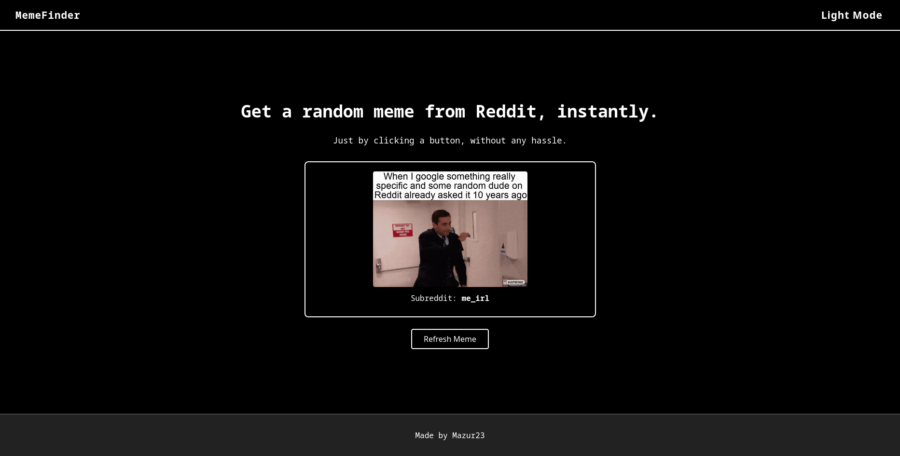

# MemeFinder

Minimalist, modern meme viewer built with Python & Flask.  
Get random memes from Reddit with a clean, responsive UI and dark/light mode.

---

## About

**MemeFinder** is a showcase project for Python/Flask web development.  
It demonstrates API integration, frontend/backend separation, responsive design, dark mode, and smooth UX with loading animations.

---

## Features

- Python 3 + Flask backend
- REST API integration ([meme-api.com](https://meme-api.com/))
- Responsive, mobile-first design
- Dark/Light mode toggle
- Animated meme loading (spinner, fade-in)
- Error handling & fallback image
- Clean code, ready for deployment

---

## Technologies Used

- Python 3
- Flask
- HTML5 & CSS3
- Vanilla JavaScript (for UX)
- REST API

---

## Getting Started

1. **Clone the repository:**
   ```bash
   git clone https://github.com/JaKuba23/MemeFinder.git
   cd MemeFinder
   ```

2. **Create and activate a virtual environment:**
   ```bash
   python3 -m venv .venv
   source .venv/bin/activate
   ```

3. **Install dependencies:**
   ```bash
   pip install -r requirements.txt
   ```

4. **Run the app:**
   ```bash
   python flaskapp.py
   ```
   The app will be available at [http://127.0.0.1:5000](http://127.0.0.1:5000)

---

## Project Structure

```
MemeFinder/
├── flaskapp.py
├── requirements.txt
├── LICENSE
├── README.md
├── .gitignore
├── static/
│   └── styles.css
└── templates/
    └── meme_index.html
```

---

## Demo



---

## License

MIT License

---


